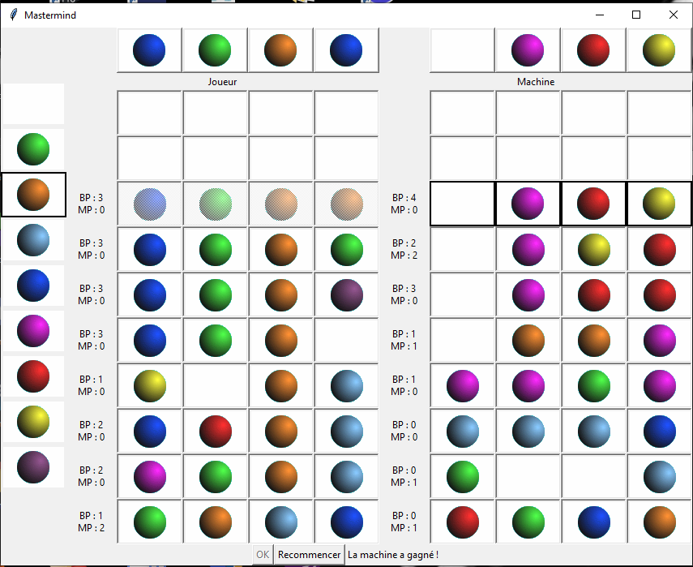

# MasterMind

This project is a graphical MasterMind made in python3.  
to download it:
  `git clone https://github.com/antoinealexisb/masterMind.git`

and to launch it:
```bash
moi@PORTABLE : python3 main_gui_mm.py

```

## ScreenShot

During a game (the bot wins): 

